# Chapter one, played end to end with the keyboard (QA-03)

**Verdict: the whole chapter-one route was completed in one uninterrupted run,
from a cleared browser to the chapter-two teaser, with keyboard input only.**
14 min 43 s of wall time, 4 deaths, the easiest difficulty row ("Kitten")
chosen through the game's own menu. All twelve manhwa sequences that belong to
the route opened, in story order. No page errors. Eight game defects found on
the way were fixed in the game code, plus one in a test that had enshrined one
of them.

What this is **not**: a human playing. It is an autopilot (`tests/campaign-ch1.cjs`)
that presses keys because of what it reads on screen, and it plays like a
cautious, clumsy player. Its deaths are mostly its own fault (see the end).

## How the run was made

| | |
|---|---|
| Harness | `tests/campaign-ch1.cjs` — registered in `tests/run.cjs` as `campaign-ch1` (60-minute budget) |
| Command | `node tests/campaign-ch1.cjs` (repo served on :8220); `CAMPAIGN_OUT=<dir>` for video, log and frames |
| Start | a new browser context, `localStorage.clear()`, reload → title menu → **New Game** (Enter) → opening film read caption by caption with Enter → difficulty screen |
| Assist | **difficulty row 0, "Kitten — Extra cores, gentler foes. A calm prowl."**, picked with the arrow keys and Enter. The pace dial was **not** used (100%). Disclosed in the log's first lines. |
| Input | `page.keyboard` only: arrows, Space (jump), X (attack, held for the Volt Burst), F (held to mend), E (interact), C (dash, when the game's own Dash Jets chip asks), Enter/Escape in menus. No mouse, no touch, no synthetic DOM events. The repair board was solved with its own keyboard path (arrows move focus, Enter takes and places). |
| Never | writes to `G.save`, flags, items, quests, `player.x/y`, boss hp; no `startGame`/`loadRoom`/`doInteract`/strike/rest calls; no time-skips; no invincibility; the loop is never sped up. |
| Reads | every frame: room, position, cores/volts, the objective line, the lesson chip, dialogue, toasts, the manhwa page, enemies and the boss's visible state (wind-ups, the Sage's coil/lunge/exhale/ring, CHIME's position), the room's tiles and drawn surface. Map knowledge (which exit leads where) comes from the room table the map screen is drawn from. |
| Pace | the machine rendered at 10–20 fps (headless, no GPU); the game's own clock ran at 0.95–1.0× wall time (logged as `PACE` / `FRAMES`). Nothing was skipped to compensate. |
| Segments | **none** — one run. (The harness can continue a segment from the localStorage the game itself wrote at a pod, `CAMPAIGN_SEGMENT=`, which was used only while developing it.) |
| Video | 1280×720, the whole run: `scratchpad/campaign/final3/campaign-ch1.webm` (102 MB, 14:43) — not committed |
| Build | integration branch `ecdd746` merged into this worktree, plus the fixes below (the run predates only the last two — the passage-pages staleness and the Dash Jets chip / goal line, both found in this run and verified separately by harness and screenshot) |

A second complete run (`final2`, same build minus the panels fixes) finished in
16:11 with 4 deaths; a first attempt (`final1`) stalled for ten minutes at the
song-locked Sage — a harness defect (below), which is why the final run is the third.

## The route, step by step

Every quotation is what the run logged off the screen. "Objective" is the
goal line under the purse; "chip" is the lesson card; "toast" is a notice.

| # | Step | Why am I doing this? | Where am I going? | What do I interact with? | How do I know it worked? | What changes afterward? |
|---|---|---|---|---|---|---|
| 1 | Title → film → difficulty | The game opens on **New Game**; the film tells the infected song. | The difficulty screen ("Select Protocol"). | Enter through the film's captions; ↑ to **Kitten**, Enter. | The cradle room appears; toast "POWER FAULT → SYSTEM RESTART". | Objective "Reach the city gates". |
| 2 | Wake and walk (W1) | Chip "Move — Walk right toward the light". | Right, out of the cradle room. | → | Chip changes to "Leave — The door has been open a long time — walk out", then W2. | The bay manhwa (4 pages). |
| 3 | Jump (W2) | Chip "Jump — A fallen beam blocks the road — press Z to hop it". | The beam ahead. | Space | Chip changes to "The city gates — Stand beneath them and press ↑". | — |
| 4 | City gate (W2) | Objective "Reach the city gates". | The gate (gold marker). | ↑ | The gate walk; room A0; the gate manhwa (2 pages). | Objective "Find who is still awake — Ratchet's booth". |
| 5 | Ratchet's booth (A0) | Chip "Ratchet's booth — A light is on inside — stand at the door and press ↑". | The booth door, the first thing past the gate. | ↑ | Inside A0B; objective "Wake Ratchet". | — |
| 6 | The letter | Chip "Read the letter — A switched-off robot with a letter on him — press E". | Ratchet. | E, then E per page | "“My battery is in the drawer beside this chair. Seat it, connect the positive wire, then the ground, and bridge the relay…”" | Chip "Open the drawer". |
| 7 | The drawer battery | Chip "The letter says his battery is in the drawer — press E". | The drawer. | E | Card "Ratchet's battery — His own battery, hidden in his drawer…" with its picture. | Chip "Restore his battery — Press E at Ratchet and wire it back in". |
| 8 | The repair board | Board hint "Place Ratchet's own battery in the empty socket." (then + terminal, − terminal, relay) | The board's targets. | Enter takes the highlighted part; → moves focus; Enter places; "Restore power". | Progress "4 / 4"; the waking film; "…My own battery. You put it back. Thank you, little one — I'm Ratchet." | The explanation (step 9). |
| 9 | Explanation | Ratchet: infected song, the marble necklace, battery pulled, "You were asleep in a recharge cradle", "Under the meadow lies a big deposit of raw marble… I'll forge a white sword". | — | E per page | Card "Spare Power Cell — …for Old Servo…"; **"This pod saves your progress and recharges you. Use it before you leave."** | Objective "Use Ratchet's pod"; the Ratchet manhwa (5 pages). |
| 10 | The pod | Chip "Use the pod — Step into the pod and press E — it saves and recharges you". | The pod. | E | Toast "Systems recharged. Progress saved." (save point W1 → A0B). | Objective "Get the Volt Pack from Ratchet". |
| 11 | The Volt Pack | Chip "The Volt Pack — Press E at Ratchet — he will explain it". | Ratchet. | E; the counter: Enter on the marked row. | "My Volt Pack fixes that. With it, hold F to mend a core, or hold X and let go for a Volt Burst." / "It costs 12 scrap." / card "12 Scrap"; counter row "Volt Pack · permanent — BUY THIS FIRST", the rest locked. Card "Volt Pack (permanent)". Scrap 12 → 0, **no floor scrap gathered**. | Objective "Try out the Volt Pack". |
| 12 | Heal | Chip "Mend a core — The pack's first surge cost you a core — stand still and hold F". | Where she stands. | hold F | The core returns. | Chip "Back outside — Stand at the den door and press ↑". |
| 13 | Strike, then burst (A0) | Chip "Strike the winch — …press X beside it", then "Volt Burst — Hold X until you crackle, then let go — the burst stops it". | The yard winch. | X; hold X ~1 s, release | Toast "The winch shudders and stops." | Objective "Solve the monument's puzzle". |
| 14 | The monument | Chip "The monument — Press E at the monument and solve its puzzle — puzzles earn IQ for skills". | East of the booth, before the way out (same screen). | E; the four arrows in the order it played them | "Knowledge gained +10 IQ". | Objective "Head east into the Scrap Meadows"; chip "Into the meadow". |
| 15 | Old Servo (A1) | Ratchet: "this spare Power Cell… It's for Old Servo, out in the meadow… Wake him." Cue "E — wake Old Servo". | Servo, at the meadow's west end. | E | "Ratchet's spare cell fits the port in his chest." / "I'm Old Servo, keeper of this winding house." / "The hub east of here has a loose floor at its west end — break through it and the caves open up." / coil errand "60 scrap and 10 IQ", "Errand taken". | Objective "Find the raw marble beneath the meadow" (it already said so when she entered A1). |
| 16 | The hub's loose floor (A2) | Servo's directions; the prompt "Loose rock — jump, hold ↓ and strike" over the cracked floor. | A2's west end. | Space, hold ↓, X | She drops into A5; toast "Chalk arrows — the old quarrymen marked their road to the marble." | — |
| 17 | The buried mouth (A5 → CV1) | Toast "Something is calling from behind the fallen rock. STRIKE it." | The rubble at the cave mouth. | X ×6, then ↑ | "The pile shifts. The sound behind it comes closer." → "The rock gives way — the tunnel is open, and it is breathing." | CV1; the cave manhwa (3 pages). |
| 18 | The survey pod (CV1 → CV1B) | A second buried mouth (same toast); the pod beyond it. | CV1B. | X at the rubble, ↑, then E at the pod | "The quarrymen's survey pod wakes: the quarry is charted on your map." / "Systems recharged. Progress saved." | Save point → CV1B. |
| 19 | The raw marble (CV2 → CV3) | Objective "Find the raw marble beneath the meadow". | The white pillar at CV3's east end. | X (a plain strike), then hold X and release | Toast **"Claws glance off the raw marble. Hold ATTACK to supercharge, then release beside it."**; then "ACQUIRED — raw cave marble / Errand ready — go back". | Objective "Bring the raw marble to Ratchet"; the marble manhwa **at the marble** ("Claws glanced off it. The charge the pack gave her did not.") — see defect 6. |
| 20 | Home to the forge | Objective "Bring the raw marble to Ratchet". | CV2 → CV1 → A5 (up its ledges) → A2 → A1 → A0 → the booth. | E at Ratchet | "You brought the marble. Steady the clamp…" / "When the blade is done I'm taking my tools to the camp by the lion's enclosure." / the forge film. Weapon claws → single. | Objective "Free the first sage — the door beside the marble quarry"; the Alpha is offered as "a detour"; the forge manhwa (3 pages). |
| 21 | The maintenance passage (CV3 → GA1T) | Toast "The cut face still glows. Beside it, the maintenance passage breathes cold blue light." | The new door in CV3. | ↑ | GA1T, then GA1D. | (The passage pages did not open on this brisk walk — see defect 7.) |
| 22 | The first Sage (GA1D) | Objective "Free the first sage". | The kneeling Sage. | strikes in its exhale; jump its ember ring; at 30% it song-locks: sword strikes fill purity | Toast "The sage kneels — the song holds its body together. Broken, but not CLEAN." → **RESCUED**; "The Meadow Sage is rescued, not destroyed…"; card "THE MEADOW SAGE"; "NULLFANG is still resisting. But CHIME writes the command back whenever he breaks it." / "Take the climb above the meadow. Silence that bell, then return to his enclosure." | Objective "Silence the bell on the climb above the meadow"; toast "Far above the meadow, the ward over the climb comes apart."; the Sage manhwa (6 pages). |
| 23 | The corridor meeting (A2 east) | Going to the camp's pod before the bell. | A2 past tile 60. | step back out of the swipe | NULLFANG drops in, winds a swipe, leaves; the meet manhwa (3 pages). | — |
| 24 | NULLFANG's break (A2 west) | On the way to the climb. | — | wait | The staged beat; the break manhwa (2 pages). | — |
| 25 | CHIME (A8 → A9) | Objective "Silence the bell on the climb above the meadow". | A2's ceiling at its west end → A8 → A9. | Volt Burst when it hovers inside the burst's reach; running jump-strikes otherwise | Toast "CHIME — it is singing at you"; boss bar "CHIME" emptied; the CHIME manhwa (3 pages). | Objective "Free NULLFANG in his enclosure past the camp"; evolution card "MK-II Frame". |
| 26 | NULLFANG (A3 → A4) | Objective "Free NULLFANG in his enclosure past the camp". | A3 east → A4. | step out of swipes, strike after them | "It remembers the corridor." / "⚡ NULLFANG is reeling — hit it NOW" / **FREED**; "NULLFANG shed it when the song let him go — a gift, not a trophy."; cards Dash Jets, SCRAPPLATE, NULLFANG'S OATH. | Objective "Climb to the Data Conduits above the camp"; chip **Dash Jets** (C); the free manhwa (4 pages) after the dash. |
| 27 | The climb above the camp (A3) | Objective "Climb to the Data Conduits above the camp"; toast "Above the camp, the conduit hatch unjams." | The camp's ledges, tiles 17–29. | jumps up the ledges | The chapter-two teaser, 5 pages: "The Scrap Meadows are behind her. The Data Conduits are not." … the title card. | Chapter one ends (`ch2Climb`). |

**The Alpha was never entered.** Ratchet offers it as "a detour" after the forge;
the route A2 → A3 → A4 does not pass through it, and the bot never took A2's
depth door. **The marble came before the lion; the Sage, CHIME and NULLFANG were
rescued, never killed** (RESCUED, the bell silenced, FREED). **CHIME behaved as a
hostile construct.** One lesson was active at a time in the opening (15 chip
steps in the owner's order), there was no backward trip, the monument stood on
the onward road on the booth's screen, the pod line was exact, and the Volt Pack
was explained before the counter opened and bought with Ratchet's 12 scrap.

## Defects found and fixed

| # | Where | What the player saw, and why it confused | Fix | Commit |
|---|---|---|---|---|
| 1 | W2, the jump lesson | The gold marker is drawn **on** the shelf, so following "Follow the gold marker" means hopping onto it before the chip ever says JUMP. Standing there, nothing is "ahead" or "above", the lesson never fires, and the chip points at her feet forever (the run sat there 8 minutes). | A one-way shelf can only be jumped onto: standing on the lesson's shelf completes the step. | `fcbdd6e` |
| 2 | A0B, the marble hand-in | Ratchet opened with "Cat-frame. Cute. Don't touch the stock with those claws." — the old story's hello to a stranger — after she had woken him and he had told her everything. | No first-meeting quip in the revised story before the forge. | `80480a0` |
| 3 | The quarry and the Sage's caves | Walking down into the marble quarry "beneath the meadow" put **Crystal Cache** (a later kingdom) across the screen; a death in the Meadow Sage's chamber said the husk was waiting "(Crystal Cache)". Every cave is zone X for its palette. | Banner and husk toast are named for the kingdom the cave lies under (CV1–CV3 and each guardian network → its lair's zone). | `0a3ffb7` |
| 4 | A3, the teaser hook | progress.js called `panelsPlay('ch2_teaser')`; no sequence has that id, so the hook never fired. | Queue `'ch2'`. (`tests/den-gate.cjs` had asserted the dead id; it now asserts the real sequence, once.) | `0b928cb`; test `7cd6022` |
| 5 | A4, the relic toast | "The song lets go. NULLFANG is free — cleansed, not killed" followed by "Glitch Fang — Torn from GLITCH.EXE." | The robot world's text layer words it as a gift a cleansed guardian sheds, in five languages. | `62a9426` |
| 6 | CV3, the marble pages | The panels' safety gate held any page shut while a machine was anywhere within 600 px horizontally (a bat on the quarry ceiling). The marble's pages never opened at the marble; in run 2 they played **after** the forge and the first Sage's revelation. | The gate asks whether a machine is within 300 px (true distance); the marble pages are stale once the forge's pages have played. Run 3: marble pages at the marble, before the forge. | `d529fa0` |
| 7 | GA1T, the passage pages | A brisk walk through the tunnel leaves them owed (they open only for a standing, unthreatened player); they would then be due on a later calm visit, after the rescue. | Stale once the Sage's pages have played. | `4630531` |
| 8 | A3/A4, after the lion | The **Dash Jets** chip named the key "→" (it had no action, so `tutHand` fell back to an arrow) and sat on top of the world readout card (the braid's "U-… infection −3% · new law …"); the goal line was printed across "SCRAPPLATE — Shard Volley". Frame `docs/campaign/09-…`. | The chip names the bound DASH key (C) and waits behind the readout; the goal line drops below the suit wheel. Frame `11-…` (staged screenshot after the fix). | `85badd9` |

## Observations not fixed (risks, with evidence)

- **The bell climb sits on top of the quarry hole.** A8's way up is A2's ceiling
  at tiles 11–14; the loose floor broken in step 16 is tiles 12–14 directly under
  it. A missed jump on the climb drops her through A2 into A5, and back up A5's
  four ledges. Run 3's room list shows A2 → A5 four times while heading for the
  bell. TERRAIN's domain; the fix is a ledge or catch under the climb.
- **Room-bound pages need a standing, calm player.** The break pages opened only
  because the bot waited after the staged beat; a player who walks straight on
  to the climb (enemies still about in A2) leaves them owed until the bell makes
  them "past".
- **"The ones you stopped are still bound — stand over one and cleanse it."** is
  repeated on entry to almost every room after the forge (A0, A1, A2, CV1, CV2,
  CV3, A9 in run 3) — a nag, and a cleansing verb never demonstrated.
- **"The climb above the meadow"** (objective and Sage) can be read as Servo's
  gantry climb ("The climb starts right behind me", A1 → A6); the bell's climb is
  A2's west ceiling. The break beat says "hub's west end"; the objective does not.
- **Damage carried over a death differs:** the Sage kept its damage after the
  bot died (408 → 233 on return, run 14), CHIME and NULLFANG reset to full.
- **The suit badge sits on the "T — Neural Tree" pill** (top-left, frame 11).
- The "cleansed, not killed" toast for NULLFANG was not in the run's toasts (the
  purification film path); the FREED ring and the free pages did show.

## Why the bot died (bot skill, not game defects)

| Death | Room | Cause (from the `HURT` lines) |
|---|---|---|
| 1, 2 | CV2 | Two hoppers in the cave (15 of the run's hits); the bot strikes on the ground and retreats late. |
| 3, 4 | A2 | Wolves and the diving flier on the hub between the Sage and the bell; the bot walks into pounces. |

In run 2 the deaths were two in A2 and two at CHIME (A9), where it spent its
volts on bursts and then could not dodge the note fans. Every death respawned at
the last pod the bot had used, and every fight was eventually won by ordinary
means. None of the four was caused by an unreadable or unfair game state.

## Harness limits found while building it (fixed in the harness)

The game renders at 10–20 fps here, so input is coarse: jumps are timed on the
game's own clock (`G.simClock`), a direction tap is at least 1.6 frames long, and
a jump is a fresh key edge. Overlapping the song-locked Sage, a turn-to-face tap
walked her through its body and flipped sides forever — run 1 stalled 10 minutes
at purity 0.75; strikes now step out to a gap first, and a 25-second
no-progress watchdog re-approaches any fight.

## Key frames (run 3 unless noted)

| | |
|---|---|
| 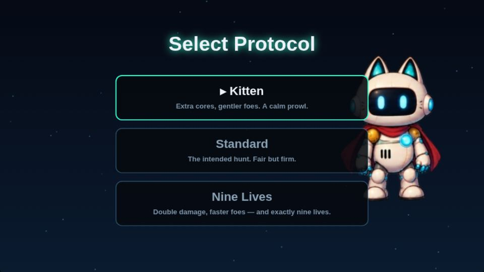 the assist, chosen in the menu | 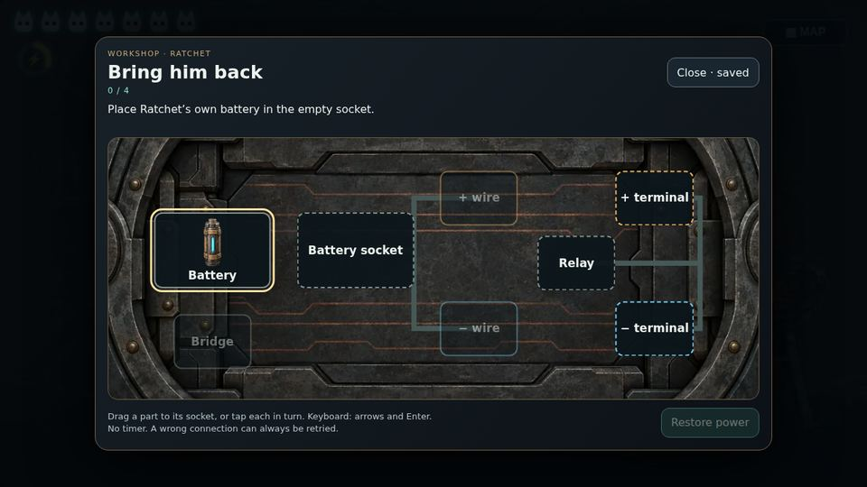 the repair board, solved by keys |
| 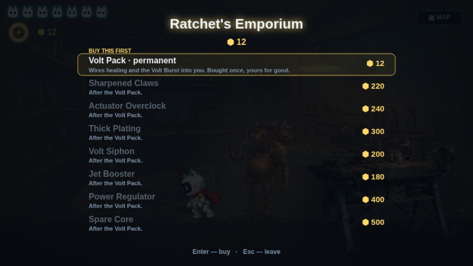 the counter: Volt Pack marked, the rest locked | 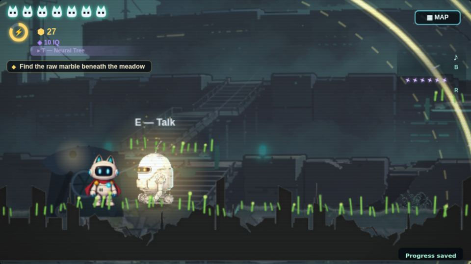 Servo wakes on Ratchet's cell |
| 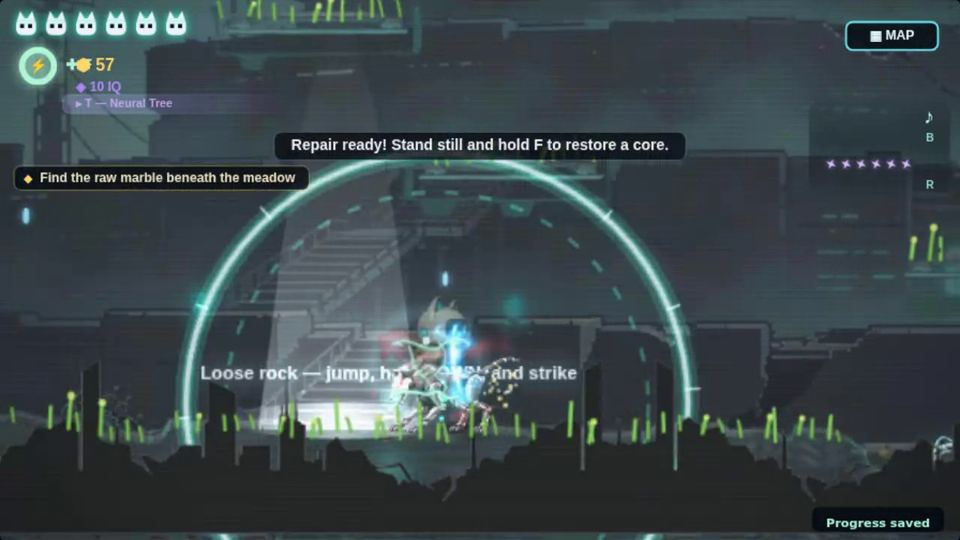 "Loose rock — jump, hold ↓ and strike" | 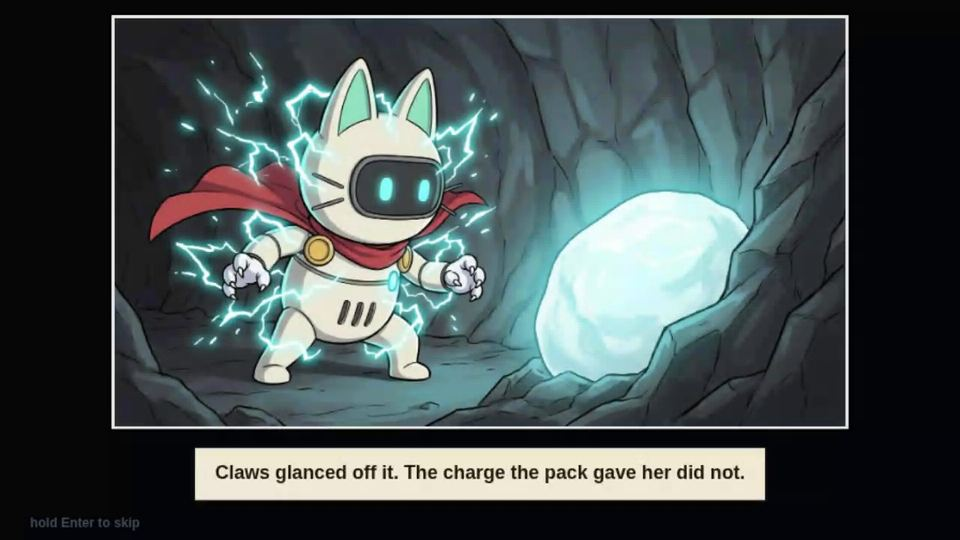 the marble pages, at the marble |
| 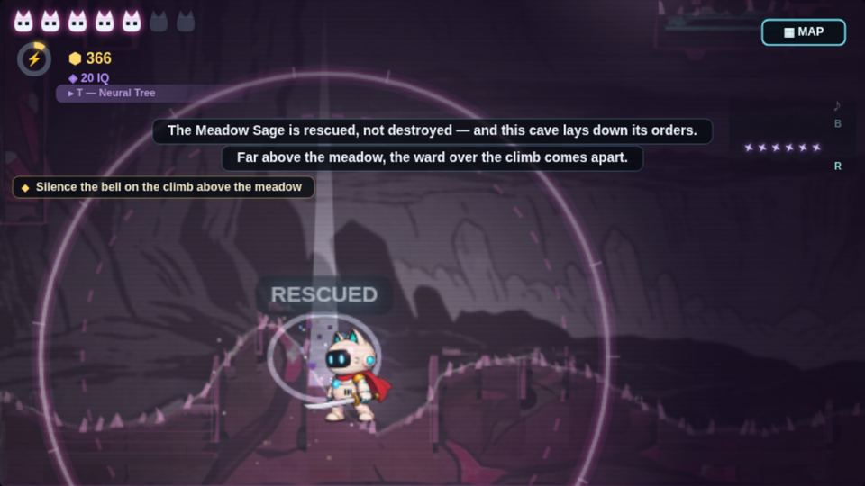 RESCUED | 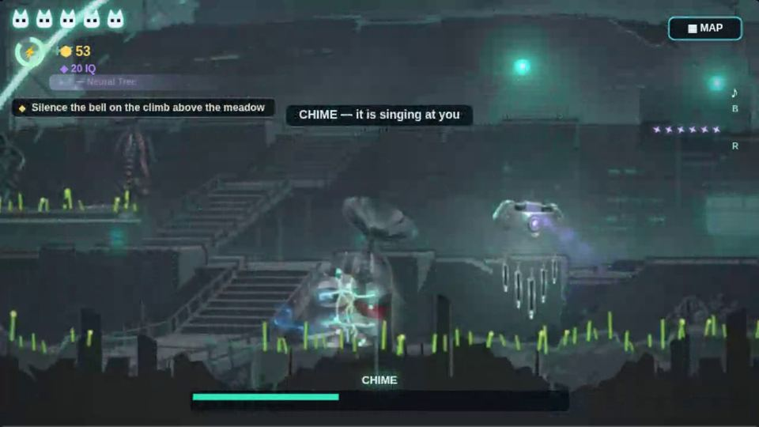 CHIME, the burst reaching it |
| 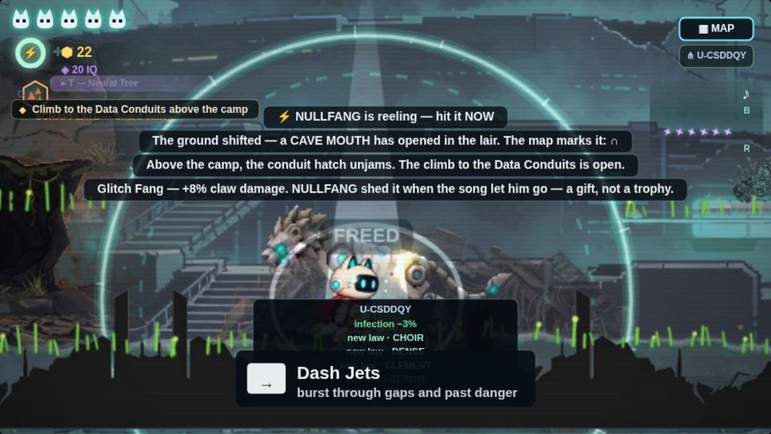 FREED — and defect 8 (chip on the readout, "→") | 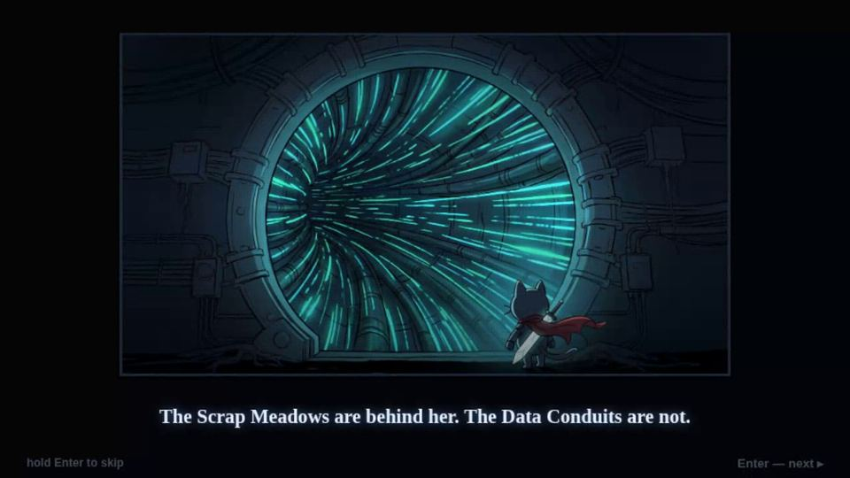 the chapter-two teaser |
| 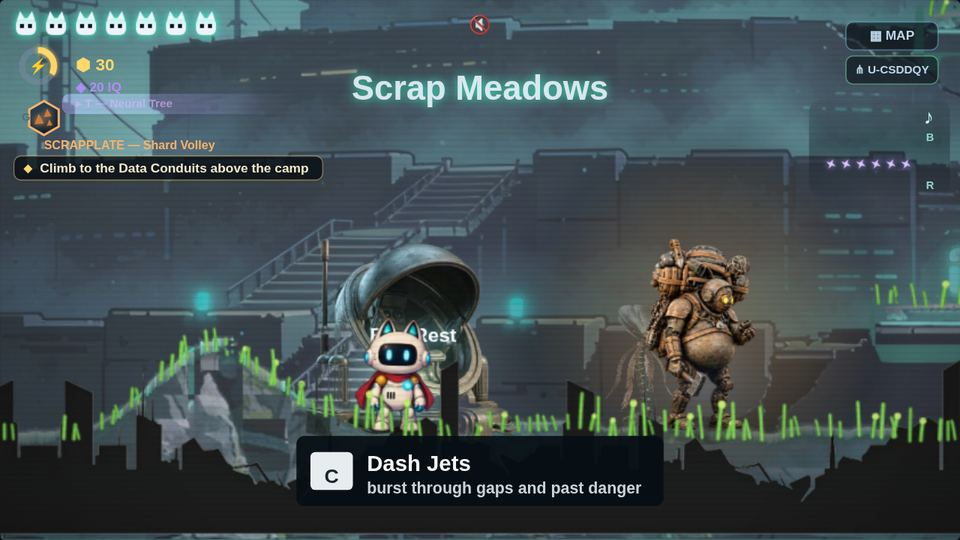 after the fix (staged from run 3's own save): "C", goal line below the suit | |
